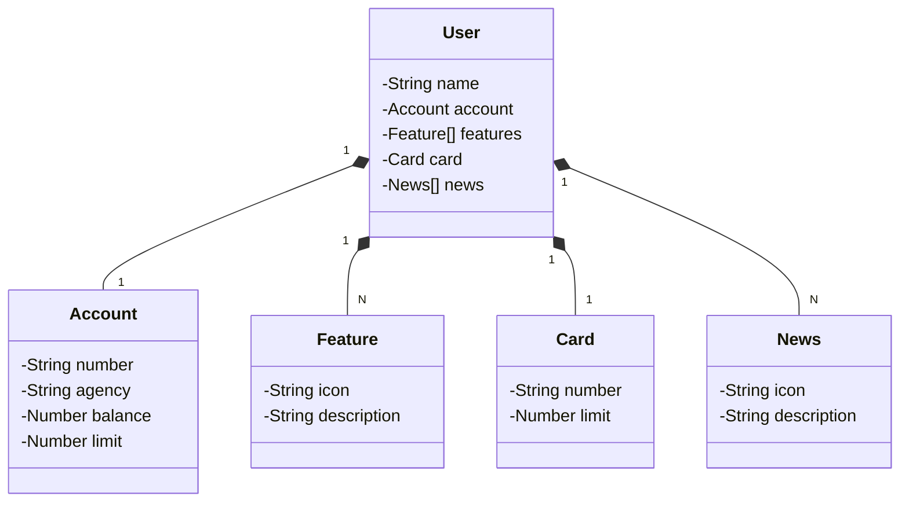
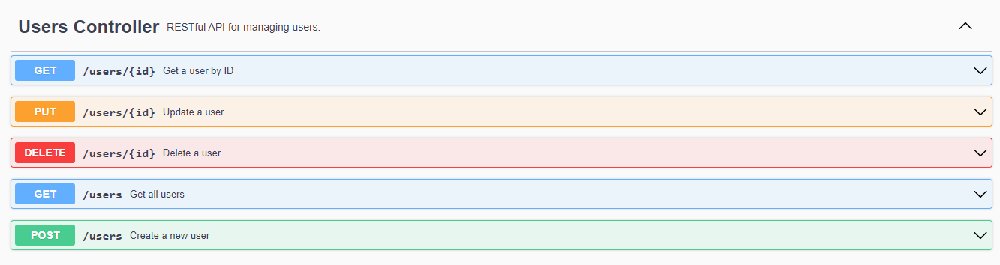

# Publicando Sua API REST na Nuvem Usando Spring Boot 3, Java 17 e Railway

Neste desafio, o objetivo foi criar uma RESTful API de cadastro de cliente.

## Tecnologias
- Java 21: Linguagem robusta e amplamente utilizada.
- Spring Boot 3: Utilizado para maximizar a produtividade por meio de sua premissa de autoconfiguração.
- Spring Data JPA: Para simplificar nossa camada de acesso aos dados, facilitando a integração com bancos de dados SQL.
- OpenAPI (Swagger): Para criar uma documentação de API fácil de entender.

## JSON do Cliente
```json
    {
    "id": 0,
    "name": "RicardoUbi",
    "account": {
        "id": 0,
        "number": "string",
        "agency": "string",
        "balance": 128000,
        "limit": 0
    },
    "card": {
        "id": 0,
        "number": "string",
        "limit": 0
    },
    "features": [
        {
        "id": 0,
        "icon": "https://www.linkedin.com/in/ricardoubi/",
        "description": "Conecte-se comigo no linkedin!"
        },
        {
        "id": 0,
        "icon": "https://github.com/RicardoUbi",
        "description": "Veja meu github!"
        }
    ],
    "news": [
        {
        "id": 0,
        "icon": "string",
        "description": "string"
        }
    ]
    }
```
## Diagrama de Classes (Domínio da API)
 Após organizarmos o JSON da forma que queriamos, fizemos este diagrama de classes. 



## Endpoints
E assim ficaram os endpoints de controller.

<div align="center">
  
</div>

## Explore o projeto e divirta-se!
