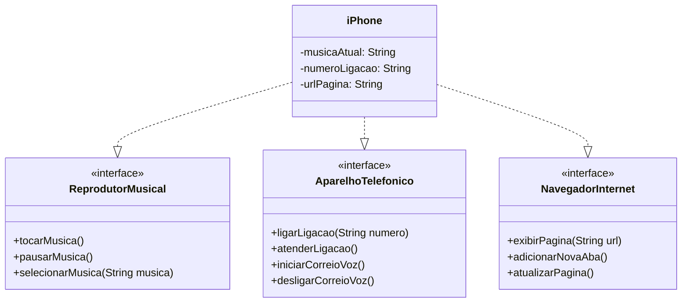

# Modelando o iPhone com UML: Funções de Músicas, Chamadas e Internet

Neste desafio, modelamos e criamos um diagrama para representação UML do componente iPhone, que implementa suas 3 funcionalidades: Reprodutor Musical, Aparelho Telefônico e Navegador de Internet.

Com base no vídeo do [Lançamento iPhone 2007](https://www.youtube.com/watch?v=9ou608QQRq8), elaborei um diagrama das classes e interfaces. Após isso, implementei as classes e interfaces no formato de arquivos `.java`.

## Funcionalidades
1. **Reprodutor Musical**
   - Métodos: `tocarMusica()`, `pausarMusica()`, `selecionarMusica(String musica)`
2. **Aparelho Telefônico**
   - Métodos: `ligar(String numero)`, `atender()`, `iniciarCorreioVoz()`, `desligarCorreioVoz()`
3. **Navegador na Internet**
   - Métodos: `exibirPagina(String url)`, `adicionarNovaAba()`, `atualizarPagina()`

## Diagrama UML ([Mermaid](https://mermaid.js.org/))

## Implementação do Projeto em Java

O projeto demonstra como usar interfaces e classes para modelar um sistema, conceito fundamental na programação orientada a objetos.

Utilizando os conceitos de interfaces e classes, implementei a construção do componente iPhone, dividindo suas partes em 4 arquivos:

### **ReprodutorMusical.java**: Interface responsável pela Reprodução Musical. Seus métodos são:
    - tocarMusica(): Iniciar a reprodução da música.
    - pausarMusica(): Pausar a reprodução da música.
    - selecionarMusica(String musica): Selecionar uma música para reprodução.

### **AparelhoTelefonico.java**: Interface responsável pelas Ligações. Seus métodos são:
    - ligarLigacao(String numero): Fazer uma ligação para um número.
    - atenderLigacao(): Atender chamada.
    - iniciarCorreioVoz(): Iniciar o correio de voz.
    - desligarCorreioVoz(): Desligar o correio de voz.

### **NavegadorInternet.java**: Interface responsável por Navegar na Internet. Seus métodos são:
    - exibirPagina(String url): Exibir uma página web.
    - adicionarNovaAba(): Adicionar uma nova aba no navegador.
    - atualizarPagina(): Atualizar a página atual.

### **iPhone.java**: Classe principal que implementa as três interfaces (ReprodutorMusical, AparelhoTelefonico e NavegadorInternet), combinando suas funcionalidades em um único componente "iPhone". Seus atributos são:
    - armazenar música atual
    - armazenar número de telefone para a chamada atual 
    - armazenar URL da página web atual

### **iPhoneDriver.java**: Classe para testar a implementação final.

#### OBS: A implementação dos métodos nas classes e interfaces apenas imprime mensagens no terminal.

## Divirta-se!
